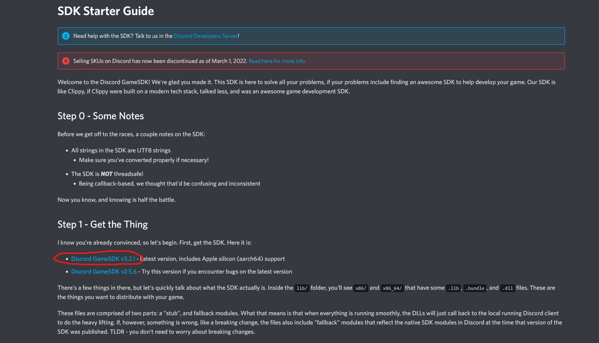

# Discord-UE4

Plugin for integrating Discord Rich Presence in Unreal Engine 4. Blueprints only example project is [available here](https://github.com/ryanjon2040/Discord-UE4-Example-Project).

[](https://discord.gg/QnzVK5R) [](https://github.com/ryanjon2040/Discord-UE4/releases)  [](https://github.com/ryanjon2040/Discord-UE4/blob/master/LICENSE)

[](https://twitter.com/ryanjon2040)


# How to
First you will need to download the binaries from Discord. Head over to [Discord Developer Portal](https://discord.com/developers/docs/game-sdk/sdk-starter-guide) and download **Discord Game SDK**.



After downloading, open the zip file and extract the library files from the `lib/x86_64` folder to the following folders of this plugin:
- `discord_game_sdk.dll` and `discord_game_sdk.dll.lib` into `Source/ThirdParty/discord-files/Win64/`
- `discord_game_sdk.bundle` and `discord_game_sdk.dylib` into `Source/ThirdParty/discord-files/Mac/`
- `discord_game_sdk.so` into `Source/ThirdParty/discord-files/Linux/x86_64-unknown-linux-gnu/` **and rename it to `libdiscord_game_sdk.so`**

After copying the binary files, open the `cpp` folder inside the zip file and extract all the contents to `Source/DiscordUE4/discord-files` folder.

Now you are good to go.

It is important to setup your game according to [Discord Startup Guide](https://discord.com/developers/docs/game-sdk/sdk-starter-guide). 

Example Setup:


# Win32 Support

This plugin does not support Win32 out-of-the-box but if you need it please check out shukenmg's repository: https://github.com/shukenmg/Discord-UE4/tree/win32

# Compile error when using as Engine Plugin

In Windows, with the latest SDK there are chances you might encounter compile errors when using this plugin as an Engine plugin. You might see the following errors:
```
warning C4005: 'TEXT': macro redefinition
error C4668: '_WIN32_WINNT_WIN10_TH2' is not defined as a preprocessor macro, replacing with '0' for '#if/#elif'
error C4668: '_WIN32_WINNT_WIN10_RS1' is not defined as a preprocessor macro, replacing with '0' for '#if/#elif'
error C4668: '_WIN32_WINNT_WIN10_TH2' is not defined as a preprocessor macro, replacing with '0' for '#if/#elif'
error C4668: '_WIN32_WINNT_WIN10_TH2' is not defined as a preprocessor macro, replacing with '0' for '#if/#elif'
error C4668: '_WIN32_WINNT_WIN10_RS2' is not defined as a preprocessor macro, replacing with '0' for '#if/#elif'
error C4668: '_WIN32_WINNT_WIN10_RS2' is not defined as a preprocessor macro, replacing with '0' for '#if/#elif'
...
```
This is because of including `windows.h` header file in Discord files. To fix it follow the steps below:

1: Open `ffi.h` and replace

`#include <Windows.h>`

with this:
```
#include "Runtime/Core/Public/Windows/AllowWindowsPlatformTypes.h"
#include "Runtime/Core/Public/Windows/MinWindows.h"
#include "Runtime/Core/Public/Windows/HideWindowsPlatformTypes.h"
```

2: Open `types.h` and remove `#include <Windows.h>`

Both files can be found under `discord-files` folder.
