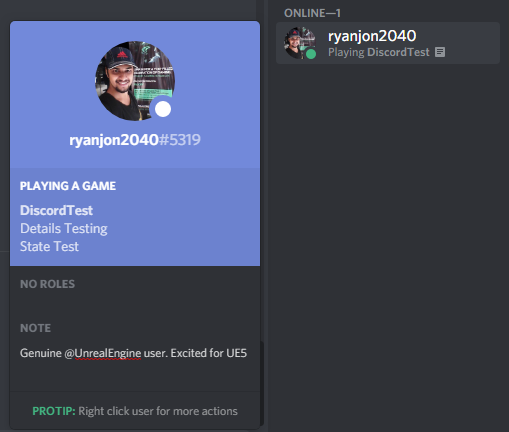

# Discord-UE4

Plugin for integrating Discord Rich Presence in Unreal Engine 4.

    

It is important to setup your game according to [Discord Startup Guide](https://discord.com/developers/docs/game-sdk/sdk-starter-guide). 

Example Setup:
